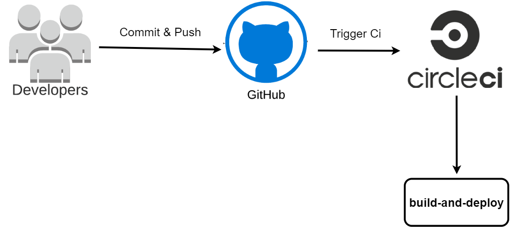

## Udagram Pipeline

### Continuous Integration
#### GitHub
The developers contribute and submit their work to the CircleCI platform's GitHub repository.
When code is posted to GitHub, it activates the CircleCI platform.

#### CircleCI
CircleCI reads the `.circleci/config.yml` file, which instructs the service on what to perform. In the example of Udagram, CircleCI will perform two tasks (frontend and backend configuration).
- **build and deploy**: Executes the `install, build, deploy` scripts from the `package.json` file for both frontend and backend.